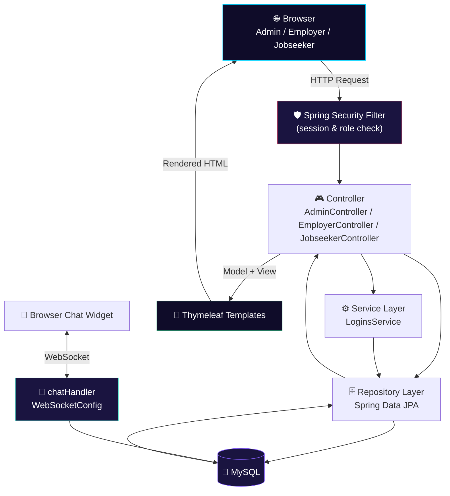

<div align="center">


<br/><br/>

<p>
  
  
  
  
  
</p>

<p>
  
  
  
</p>

<h3>💼 A full-stack job portal with employer job postings, jobseeker applications, and live in-app chat</h3>

</div>

---

## 📖 Overview

**Job Portal** is a full-stack recruitment platform built on **Java, Spring Boot, Spring Security, Spring Data JPA (Hibernate), Thymeleaf, and MySQL**. It runs three portals from a single codebase — a public job listing site, an **Employer** dashboard for posting and managing jobs, and a **Jobseeker** dashboard for applying and tracking applications — plus a **real-time WebSocket chat** between employers and jobseekers.

<table align="center">
<tr>
<td align="center">🏗️<br/><b>Architecture</b><br/>Spring MVC (Controller → Service/Repository → JPA)</td>
<td align="center">🔐<br/><b>Auth</b><br/>Spring Security, role-based sessions</td>
<td align="center">💬<br/><b>Realtime</b><br/>WebSocket chat rooms</td>
<td align="center">🎨<br/><b>UI Layer</b><br/>Thymeleaf + Bootstrap + jQuery</td>
</tr>
</table>

## ✨ Features

<table align="center" width="100%">
<tr>
<td width="33%" valign="top">

### 🌐 Public Site
- Home / job listings
- Job search
- Company categories
- Jobseeker sign-up / login

</td>
<td width="33%" valign="top">

### 🏢 Employer Portal
- Create job posts
- Manage / view posted jobs
- View applicants per job
- View jobseeker profiles
- Employer dashboard & profile

</td>
<td width="33%" valign="top">

### 👤 Jobseeker Portal
- Search & browse jobs
- Apply to jobs
- Save jobs for later
- Track applied jobs
- Profile, education & experience

</td>
</tr>
</table>

<div align="center">

### 🛠️ Admin Panel
Manage employers · manage jobseekers · manage job categories · manage employer categories · manage all job posts · dashboard

### 💬 Live Chat
Employers and jobseekers message each other in real time through WebSocket-backed chat rooms

</div>

## 🛠️ Technology Stack

<div align="center">


</div>

| Layer | Technology |
|---|---|
| **Backend** | Java, Spring Boot, Spring MVC, Spring Data JPA (Hibernate), Spring Security, Spring WebSocket |
| **Frontend** | Thymeleaf, Bootstrap, jQuery, DataTables |
| **Database** | MySQL |
| **Build Tool** | Maven |
| **Other** | Google Gson, Lombok |

## 🏗️ Architecture & Workflow



**Request flow:** every request passes through the **Spring Security filter chain**. Controllers delegate to the service/repository layer, JPA/Hibernate talks to MySQL, and Thymeleaf renders the role-appropriate template. Chat runs on a separate **WebSocket** connection handled by `chatHandler`, persisting messages against `Chatroom` / `ChatMessage`.

## 📂 Domain Model

Core entities: `Users`, `Userjobseeker`, `Usercompany`, `Usereducation`, `Userexperience`, `Job`, `Jobapplication`, `Jobcategories`, `Companycategories`, `Savedpost`, `Chatroom`, `ChatMessage`.

`LoginTypes` enum: `ADMIN` · `EMPLOYER` · `JOBSEEKER`

## 🚀 Installation

**1. Clone the repository**
```bash
git clone https://github.com/Nesara29/prajju.git
cd prajju/JobPortal
```

**2. Configure the database**

Create a MySQL database (e.g. `job`) and update `src/main/resources/application.properties`:
```properties
spring.datasource.driverClassName=com.mysql.cj.jdbc.Driver
spring.datasource.url=jdbc:mysql://localhost:3306/job
spring.datasource.username=root
spring.datasource.password=YOUR_DB_PASSWORD
```

**3. Build the project**
```bash
mvn clean install
```

**4. Run the application**
```bash
mvn spring-boot:run
# or
./mvnw spring-boot:run
```

**5. Open your browser**
```
http://localhost:8080
```

## 📂 Project Structure

```
JobPortal/
├── src/
│   ├── main/
│   │   ├── java/com/project/jobportal/
│   │   │   ├── chat/               → WebSocketConfig, chatHandler
│   │   │   ├── config/             → SpringSecurity.java
│   │   │   ├── controller/         → AdminController, EmployerController, JobseekerController
│   │   │   ├── entity/             → Job, Jobapplication, Chatroom, Users, etc.
│   │   │   ├── repository/         → Spring Data JPA repositories
│   │   │   ├── security/           → CustomLoginsDetailsService
│   │   │   ├── service/            → LoginsService (+ impl)
│   │   │   └── jobportalApplication.java
│   │   └── resources/
│   │       ├── templates/
│   │       │   ├── admin/          → dashboard, employers, jobseekers, jobcats, jobs
│   │       │   ├── employer/       → dashboard, createpost, jobs, viewapplied
│   │       │   └── jobseeker/      → dashboard, searchjobs, appliedjobs, savedjobs
│   │       ├── static/assets/      → css, js, images, webfonts
│   │       └── application.properties
│   └── test/
├── uploads/profileimage/           → runtime profile image storage
├── pom.xml
├── mvnw / mvnw.cmd
└── README.md
```

## 🎯 Learning Outcomes

☕ Java & Spring Boot &nbsp;•&nbsp; 🎮 Spring MVC &nbsp;•&nbsp; 🛡️ Spring Security &nbsp;•&nbsp; 🗄️ Spring Data JPA (Hibernate) &nbsp;•&nbsp; 🔌 WebSocket real-time messaging &nbsp;•&nbsp; 🐬 MySQL relational design &nbsp;•&nbsp; 🎨 Thymeleaf templating &nbsp;•&nbsp; 📦 Maven project management

## 🚀 Future Enhancements

<table align="center">
<tr>
<td>📎 Resume Upload (PDF/DOC)</td>
<td>✉️ Email Notifications</td>
<td>🗓️ Interview Scheduling</td>
</tr>
<tr>
<td>🎯 Job Recommendations</td>
<td>📊 Admin Analytics Dashboard</td>
<td>🔗 REST API Integration</td>
</tr>
<tr>
<td>🔑 JWT Authentication</td>
<td>☁️ Cloud Deployment (AWS/Azure)</td>
<td>📱 Mobile Application</td>
</tr>
</table>

## 🤝 Contributing

1. Fork the repository.
2. Create a feature branch.
3. Commit your changes.
4. Push to your branch.
5. Open a Pull Request.

## 👨‍💻 Developer

<div align="center">

| | |
|---|---|
| 🧑‍💻 **Name** | `NESARA` |
| 🐙 **GitHub** | https://github.com/Nesara29 |

</div>

## 🔗 Project Links

<div align="center">

<a href="https://github.com/Nesara29/prajju">
  
</a>
<a href="https://github.com/Nesara29/prajju/issues">
  
</a>
<a href="https://github.com/Nesara29/prajju/fork">
  
</a>

</div>

## 📄 License

This project is intended for **educational and learning purposes**. Free to use, modify, and extend for academic or personal projects.

## ⭐ Support

If you found this project useful, please give it a ⭐ **Star** on GitHub.


</div>
