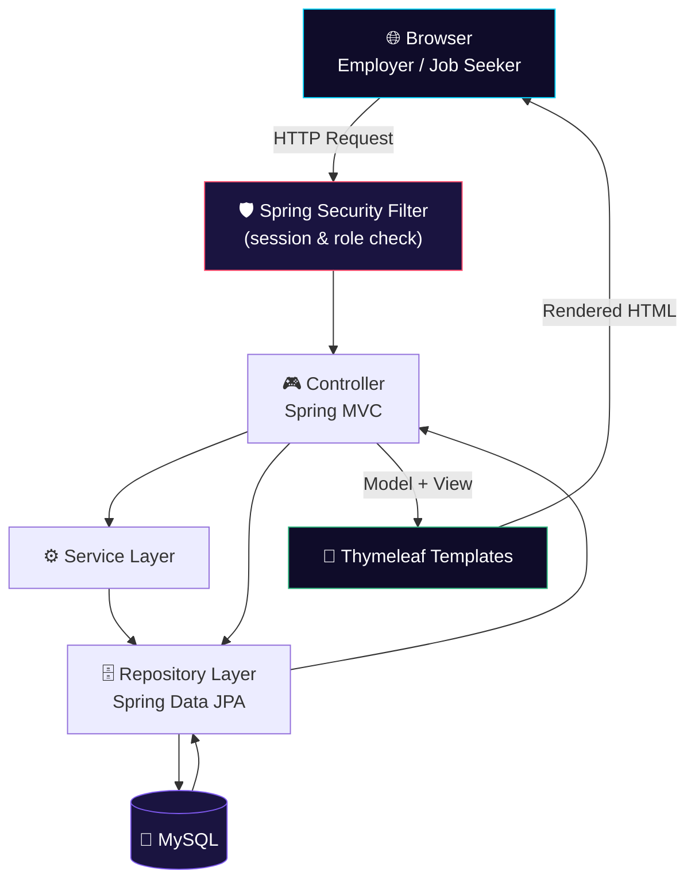

<div align="center">


<br/><br/>

<p>
  
  
  
  
  
</p>

<p>
  
  
  
</p>

<h3>💼 A full-stack, role-based online job portal connecting employers and job seekers — built with Java and Spring Boot</h3>

</div>

---

## 📖 Overview

**Online Job Portal System** is a full-stack recruitment web application built on **Java, Spring Boot, Spring Security, Spring Data JPA (Hibernate), Thymeleaf, and MySQL**. It runs two connected portals from a single codebase — an **Employer** side for posting and managing jobs, and a **Job Seeker** side for searching, applying, and tracking applications — all protected by Spring Security authentication.

Employers register, post job openings, and review applicants against each listing. Job seekers register, search and browse open roles, maintain a profile and resume, apply with one click, and track every application from a personal dashboard.

<table align="center">
<tr>
<td align="center">🏗️<br/><b>Architecture</b><br/>Spring MVC (Controller → Service/Repository → JPA)</td>
<td align="center">🔐<br/><b>Auth</b><br/>Spring Security, role-based sessions</td>
<td align="center">🗄️<br/><b>Data Layer</b><br/>Spring Data JPA + Hibernate</td>
<td align="center">🎨<br/><b>UI Layer</b><br/>Thymeleaf + HTML5/CSS3/JS</td>
</tr>
</table>

## ✨ Features

<table align="center" width="100%">
<tr>
<td width="50%" valign="top">

### 🏢 Employer Portal
- Employer registration & login
- Post new job openings
- Edit / manage existing listings
- Review applicants per posting
- Employer dashboard

</td>
<td width="50%" valign="top">

### 👤 Job Seeker Portal
- Job seeker registration & login
- Search & browse open jobs
- One-click apply flow
- Profile & resume management
- Application tracking dashboard

</td>
</tr>
</table>

> 🔑 Access is enforced by **Spring Security** — authenticated sessions gate posting, applying, and dashboard routes by user role.

## 🛠️ Technology Stack

<div align="center">


</div>

| Layer | Technology |
|---|---|
| **Backend** | Java, Spring Boot, Spring MVC, Spring Data JPA (Hibernate), Spring Security |
| **Frontend** | Thymeleaf, HTML5, CSS3, JavaScript |
| **Database** | MySQL |
| **Build Tool** | Maven |
| **Tools** | Eclipse / IntelliJ IDEA, Git, GitHub |

## 🏗️ Architecture & Workflow



**Request flow:** every request passes through the **Spring Security filter chain**, which checks the session against the requested route. Controllers delegate to the service/repository layer, JPA/Hibernate talks to MySQL, and Thymeleaf renders the employer or job-seeker template.


## 🚀 Installation & Setup

### 1️⃣ Clone the Repository
```bash
git clone https://github.com/YOUR_USERNAME/OnlineJobPortalSystem.git
```

### 2️⃣ Navigate to the Project
```bash
cd OnlineJobPortalSystem
```

### 3️⃣ Configure the Database
Create a MySQL database and update:
```
src/main/resources/application.properties
```

```properties
spring.datasource.driverClassName=com.mysql.cj.jdbc.Driver
spring.datasource.url=jdbc:mysql://localhost:3306/job_portal
spring.datasource.username=YOUR_DB_USERNAME
spring.datasource.password=YOUR_DB_PASSWORD
```

### 4️⃣ Build the Project
```bash
mvn clean install
```

### 5️⃣ Run the Application
```bash
mvn spring-boot:run
```
or, using the bundled Maven wrapper:
```bash
./mvnw spring-boot:run
```

### 6️⃣ Open the Application
```
http://localhost:8080
```

## 📂 Project Structure

```
OnlineJobPortalSystem/
├── src/
│   ├── main/
│   │   ├── java/
│   │   ├── resources/
│   │   │   ├── templates/
│   │   │   ├── static/
│   │   │   └── application.properties
│   └── test/
├── docs/screenshots/
├── pom.xml
├── mvnw / mvnw.cmd
└── README.md
```

## 🎯 Learning Outcomes

☕ Java & Spring Boot &nbsp;•&nbsp; 🎮 Spring MVC &nbsp;•&nbsp; 🛡️ Spring Security &nbsp;•&nbsp; 🗄️ Spring Data JPA (Hibernate) &nbsp;•&nbsp; 🐬 MySQL relational design &nbsp;•&nbsp; 🎨 Thymeleaf templating &nbsp;•&nbsp; ⚡ CRUD operations end to end &nbsp;•&nbsp; 📦 Maven project management

## 🚀 Future Enhancements

<table align="center">
<tr>
<td>📎 Resume Upload (PDF/DOC)</td>
<td>✉️ Email Notifications</td>
<td>🗓️ Interview Scheduling</td>
</tr>
<tr>
<td>🏢 Company Profiles</td>
<td>🎯 Job Recommendations</td>
<td>📊 Admin Analytics Dashboard</td>
</tr>
<tr>
<td>🔗 REST API Integration</td>
<td>🔑 JWT Authentication</td>
<td>☁️ Cloud Deployment (AWS/Azure)</td>
</tr>
</table>

## 🤝 Contributing

1. 🍴 Fork the repository
2. 🌿 Create a feature branch
3. 💾 Commit your changes
4. 📤 Push your branch
5. 🔁 Submit a Pull Request


## 🔗 Project Links

<div align="center">

<a href="https://github.com/YOUR_USERNAME/OnlineJobPortalSystem">
  
</a>
<a href="https://github.com/YOUR_USERNAME/OnlineJobPortalSystem/issues">
  
</a>
<a href="https://github.com/YOUR_USERNAME/OnlineJobPortalSystem/fork">
  
</a>

</div>

## 📄 License

This project is intended for **educational and learning purposes**. Free to use, modify, and extend for academic or personal projects.

## ⭐ Support

If you found this project useful, please give it a ⭐ **Star** on GitHub.


</div>
